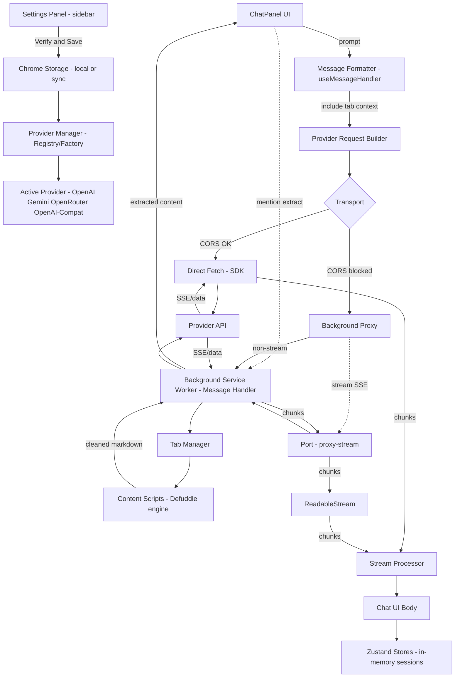

# AI Browser Sidebar Extension

A privacy‑focused browser extension for AI‑powered chat with web content using your own API keys (BYOK). The sidebar is a Shadow DOM overlay that's resizable, draggable, and works across Chromium browsers.

## Features

- 🔒 **Privacy-First**: All data stays local, encrypted API key storage
- 💬 **AI Chat**: Full streaming support with OpenAI GPT-5 and Google Gemini 2.5
- 🧠 **Thinking Display**: Real-time reasoning visualization with timer
- 🎨 **Customizable UI**: Resizable & movable sidebar, light/dark themes
- 🌐 **Universal Compatibility**: Works in Chrome, Arc, Edge, and other Chromium browsers
- 🧩 **Multi-Provider (BYOK)**: OpenAI and Google Gemini fully integrated
- 🔍 **Web Search**: Automatic web search grounding for enhanced responses
- 🔄 **Smart Context Management**: OpenAI Response API with intelligent conversation continuity
- 📑 **Content Extraction**: Smart page content capture with markdown conversion
- ⚡ **Slash Commands**: Type `/` for quick actions (e.g., /summarize, /fact-check)
- 🎯 **Multi-Tab Context**: Smart @ mention system to aggregate content from multiple browser tabs with visual management
- 💾 **Session Management**: Tab+URL based sessions with automatic cleanup on tab close

## Tech Stack

- **Frontend**: React 18 + TypeScript (strict mode)
- **Build**: Vite + CRXJS (Manifest V3)
- **Styling**: Layered CSS architecture with CSS variables + dark mode support
- **State**: Zustand stores for chat/settings/API keys
- **AI Providers**: OpenAI Response API, Gemini API
- **Testing**: Vitest + React Testing Library (>90% coverage)
- **Virtualization**: react-window for message lists
- **Markdown**: react-markdown + code highlighting + KaTeX math

## Development

### Prerequisites

- Node.js 18+
- Chromium-based browser (Chrome, Arc, Edge, Brave, etc.)
- Git

### Installation

```bash
# Clone the repository
git clone [repository-url]
cd browser-sidebar

# Install dependencies
npm install

# Start development server
npm run dev
```

### Mermaid Diagram



### Build

```bash
# Build for production
npm run build

# Build and watch for changes
npm run watch

# Regenerate dist after changes (Chrome load)
npx vite build
```

### Testing

```bash
# Run unit tests once (no watch)
npm test

# Watch mode for local development
npm run test:watch

# Run tests with coverage
npm run test:coverage

# Run tests in UI mode
npm run test:ui
```

## Usage

1. **Install the extension**: Load the `dist` folder as an unpacked extension in your browser
2. **Click the extension icon**: Opens a floating sidebar on the right side of the page
3. **Interact with the sidebar**:
   - Drag the header to move it anywhere
   - Drag the left edge to resize (300-800px width)
   - Click the X button or extension icon to close
4. **Configure AI providers**: Add your API keys in the extension settings

### Slash Commands

- Type `/` in the chat input to open the command dropdown
- Arrow keys to navigate, `Enter` to confirm
- Commands expand to full prompts when sent; some set a model just for that turn
- Built-ins: `/summarize`, `/explain`, `/analyze`, `/comment`, `/fact-check` (uses `gemini-2.5-flash`)

## Architecture Status

The extension now uses the new modular, service-oriented architecture by default.

Key points:

- Providers prefer the transport layer by default and fall back to SDK/fetch when no transport is available.
- Hooks use the service layer (EngineManagerService, ChatService) exclusively.
- The OpenAI-compatible proxy always uses the Background/Direct transport policy.

### Implementation Notes

- New architecture components are gated behind the feature flag
- Existing code paths remain untouched as fallbacks
- No user-facing changes during the refactor process
- All current functionality preserved throughout the transition

## Multi-Tab Content Injection

The extension supports aggregating content from multiple browser tabs in your conversations with AI. This powerful feature allows you to provide comprehensive context from different sources.

### How It Works

- **Automatic Current Tab**: The content from your current tab is automatically loaded when you open the sidebar
- **@ Mention System**: Type `@` in the chat input to search and select additional tabs
- **Smart Content Extraction**: Uses advanced algorithms to extract clean, readable content from web pages
- **Structured Delivery**: All tab contents are sent to AI in a structured XML format for better understanding

### Using the @ Mention System

1. **Open the Chat Input**: Click in the message input area at the bottom of the sidebar
2. **Type @**: Start typing the `@` symbol to trigger the tab selection dropdown
3. **Search Tabs**: Continue typing to filter available tabs by title, domain, or URL
4. **Navigate**: Use arrow keys to navigate through the list, or click with your mouse
5. **Select**: Press Enter or click to select a tab - its content will be loaded
6. **Send**: Compose your message and send - all loaded tab content is included automatically

### Visual Indicators

- **Tab Chips**: Selected tabs appear as removable chips above the input
- **Content Previews**: Expandable content previews show what will be sent to AI
- **Loading States**: Visual indicators show when content is being extracted
- **Status Icons**: ✓ for completed, spinner for loading, warning for errors

### Keyboard Shortcuts

- `@` - Open tab selection dropdown
- `↑/↓` - Navigate dropdown options
- `Enter` - Select highlighted tab
- `Escape` - Close dropdown
- `Tab` - Navigate between UI elements

### Content Management

- **View Content**: Click tab headers in the preview area to expand/collapse content
- **Remove Tabs**: Click the X button on individual tab chips or preview headers
- **Clear All**: Use the "Clear All" button to remove all loaded tabs at once
- **Re-extract**: Refresh content if a page has been updated

### Best Practices

- **Relevant Content**: Select tabs that are relevant to your question for better AI responses
- **Performance**: Keep the number of tabs reasonable (recommended: 5-10 tabs max)
- **Content Quality**: The AI works best with text-heavy pages rather than media-heavy sites
- **Context**: Provide context about why you're including multiple tabs in your question

### Supported Content Types

- **Articles & Blogs**: News articles, blog posts, documentation
- **Reference Materials**: Wikipedia, Stack Overflow, technical docs
- **Product Pages**: E-commerce listings, software descriptions
- **Forums & Discussions**: Reddit threads, forum posts (where accessible)
- **Academic Content**: Research papers, educational resources

### Limitations

- **Restricted URLs**: Cannot access `chrome://`, `file://`, or extension pages
- **Authentication**: Cannot access content behind login walls
- **Dynamic Content**: Some JavaScript-heavy sites may have limited content extraction
- **Size Limits**: Very large pages may be truncated for performance
- **Rate Limits**: Extraction is throttled to prevent overwhelming the browser

### Troubleshooting

#### Tab Content Not Loading

- **Check URL**: Ensure the tab URL is accessible (not chrome:// or extension:// pages)
- **Reload Page**: Try refreshing the page if content seems incomplete
- **Network Issues**: Check if the page loads normally in the browser
- **Content Scripts**: Some sites may block content script injection

#### Dropdown Not Appearing

- **Permissions**: Ensure the extension has access to the tab's domain
- **Focus**: Make sure the input field is focused when typing `@`
- **Spelling**: Ensure you're typing the `@` symbol correctly
- **Browser Compatibility**: Verify you're using a supported Chromium-based browser

#### Performance Issues

- **Reduce Tabs**: Try using fewer tabs if the sidebar becomes slow
- **Clear Cache**: Close and reopen the sidebar to clear cached content
- **Browser Memory**: Close unused browser tabs to free up memory
- **Content Size**: Avoid selecting very large documents

#### Content Quality Issues

- **Page Structure**: Some sites may not extract content cleanly
- **Re-extract**: Try using the re-extract button if content looks wrong
- **Manual Selection**: Consider copying and pasting specific content if needed
- **Alternative Sources**: Try finding the same information on a different site

### Privacy & Security

- **Local Processing**: All content extraction happens locally in your browser
- **No Data Collection**: Tab content is never sent to extension servers
- **Encrypted Storage**: API keys are encrypted, sessions are memory-only
- **Automatic Cleanup**: Sessions cleared on tab close, cache expires after 5 minutes
- **BYOK**: Your API keys remain under your control

## Session Management

The extension uses an intelligent session management system to maintain separate conversation contexts:

### Session Architecture

- **Session Keys**: Each unique tab+URL combination gets its own session (`tab_123:https://example.com/page?id=456`)
- **URL Normalization**: Query parameters create different sessions, hash fragments don't
- **Memory-Only Storage**: All sessions exist only in memory - no disk persistence
- **Hierarchical Stores**: SessionStore holds all data, other stores delegate to active session

### Session Lifecycle

**Sessions Continue When:**

- Refreshing the same page (F5)
- Hiding/showing the sidebar (React stays mounted)
- Navigating to same URL with different hash
- Returning to a previously visited URL in the same tab

**New Sessions Created When:**

- Opening a new tab
- Navigating to a different URL (including different query params)
- First visit to a URL in a tab

**Sessions Cleared When:**

- Tab is closed (all sessions for that tab removed automatically)
- User clicks "Clear conversation" (current session reset)
- Browser/extension restarts (all sessions lost)

### Sidebar Behavior

- **First Click**: Injects sidebar → mounts React → creates/retrieves session
- **Hide (Click X or Icon)**: CSS hide only - React stays mounted, session preserved
- **Show Again**: CSS show - no re-mount, conversation continues exactly where left off
- **Page Navigation**: Full unmount → must manually reopen → session retrieved if exists
- **Tab Close**: Automatic cleanup via `TAB_CLOSED` event

## Project Structure

```
browser-sidebar/
├── src/
│   ├── config/        # Configuration and constants
│   │   ├── models.ts      # AI model definitions
│   │   └── systemPrompt.ts # System prompts
│   ├── data/          # Data management layer
│   │   ├── security/      # AES-GCM encryption
│   │   ├── storage/       # Chrome storage + key management
│   │   └── store/         # Zustand state management
│   ├── extension/     # Browser extension infrastructure
│   │   ├── background/    # Service worker components
│   │   │   ├── cache/     # Content caching system
│   │   │   └── queue/     # Extraction queue management
│   │   └── messaging/     # Message passing system
│   ├── provider/      # AI provider implementations
│   │   ├── openai/        # OpenAI GPT-5 series
│   │   └── gemini/        # Google Gemini 2.5
│   ├── shared/        # Shared utilities
│   │   └── utils/         # Common utility functions
│   ├── sidebar/       # React UI with Shadow DOM
│   │   ├── ChatPanel.tsx  # Main chat interface
│   │   ├── components/    # React components library
│   │   │   ├── layout/    # Header, Footer, Body, ResizeHandles
│   │   │   ├── ui/        # Reusable UI components
│   │   │   └── ...        # Chat, AI, and content components
│   │   ├── contexts/      # React context providers
│   │   ├── hooks/         # Custom React hooks
│   │   │   └── ai/        # AI integration hooks
│   │   └── styles/        # Layered CSS architecture
│   │       ├── 0-foundation/  # Variables, animations, reset
│   │       ├── 1-base/        # Base styles, typography
│   │       ├── 2-layout/      # Layout and structure
│   │       ├── 3-components/  # Component styles
│   │       └── 4-features/    # Feature-specific styles
│   ├── tabext/        # Content extraction system
│   │   ├── core/          # Core functionality
│   │   ├── extraction/    # Content extraction pipeline
│   │   │   ├── analyzers/ # Content analysis
│   │   │   ├── converters/# Format conversion
│   │   │   └── extractors/# Extraction strategies
│   │   └── utils/         # DOM and text utilities
│   └── types/         # TypeScript definitions
├── tests/             # Comprehensive test suites
├── dist/              # Build output (load in browser)
└── docs/              # Documentation
    └── stages/        # Implementation stage guides
```

## Architecture & Data Flow

This section shows how data moves through the extension — where API keys are stored, how chat requests are formed and streamed, how responses are handled, and how tab content is extracted and injected.

### High‑Level Flow

```
┌─────────────┐        ┌──────────────────┐        ┌────────────────────┐
│  Settings   │  save  │  Chrome Storage  │  read  │  Provider Manager   │
│ (Sidebar UI)├──────▶ │  (local/sync)    ├──────▶ │ (Registry/Factory)  │
└─────┬───────┘        └────────┬─────────┘        └──────────┬─────────┘
      │                          init providers                         │
      │                                                                ▼
      │                                                        ┌──────────────┐
      │                                                        │ Active       │
      │                                                        │ Provider     │
      │                                                        │ (OpenAI,     │
      │                                                        │  Gemini,     │
      │                                                        │  OpenRouter, │
      │                                                        │  OpenAI‑Compat)
      │                                                        └─────┬────────┘
      │                                                              │
      │                                                              │ stream
      │                                                              ▼
┌─────▼────────┐  input  ┌─────────────────┐   build   ┌────────────────────┐
│ ChatPanel UI │ ─────▶  │ Message Handler │ ───────▶  │ Provider Request    │
│ (collects    │         │ (format prompt  │           │ Builder (provider)  │
│  prompt)     │         │  + tab context) │           └──────────┬─────────┘
└─────┬────────┘         └────────┬────────┘                      │
      │                            │                               │ fetch
      │ extract                    │                               │
      ▼                            │                         ┌──────▼──────────┐
┌──────────────┐  msg     ┌────────▼─────────┐  DOM        │ Network Transport │
│ Tab Content  │ ───────▶ │ Background SW    │ ─────────▶  │  (Direct or       │
│ (content     │          │  (Tab Manager +  │  content    │   Background       │
│  script)     │ ◀─────── │  Proxy Handler)  │  extract    │   Proxy)           │
└──────────────┘  result  └────────┬─────────┘             └────────┬──────────┘
                                    │                                │
                                    │                                │
                                    │                         ┌──────▼───────────┐
                                    │                         │ Provider API     │
                                    │                         │ (OpenAI, Gemini, │
                                    │                         │  OpenRouter,     │
                                    │                         │  Kimi, etc.)     │
                                    │                         └────────┬─────────┘
                                    │                                  │
                                    └──────────────────────────────────┘
```

### Key Paths

- **BYOK (API keys):**
  - UI: `src/sidebar/components/Settings/Settings.tsx` verifies and saves keys.
  - Storage: Keys are stored in extension storage (Chrome local/sync). OpenAI‑compatible providers are stored via `src/data/storage/keys/compat.ts` (local; no cloud sync). Keys are only used on device.
  - Discovery: Model groups in the Model Selector include compat providers found by `listOpenAICompatProviders()`.

- **Model selection & provider initialization:**
  - UI: `src/sidebar/components/ModelSelector.tsx` groups models by provider; when you choose a model it updates the selected model in the settings store.
  - Manager: `src/sidebar/hooks/ai/useAIChat.ts` delegates to `src/services/engine/EngineManagerService.ts`, which uses `src/core/engine/EngineFactory.ts` + `src/core/engine/EngineRegistry.ts` to initialize and switch engines.

- **Tab content extraction:**
  - Triggered from ChatPanel through `useTabExtraction` and the @‑mention UI.
  - Messages: Sidebar sends `GET_ALL_TABS` / `EXTRACT_TAB_CONTENT` to the background.
  - Background: `TabManager` coordinates content scripts in `src/content/*` to extract and clean DOM → Markdown. Pure extraction utilities live in `src/core/extraction/*`.
  - Result: Extracted content is returned to the sidebar and previewed; the message formatter includes it as context automatically.

- **Chat request build & send:**
  - Prompt capture: `src/sidebar/ChatPanel.tsx` collects the user’s input; `useMessageHandler` formats it with any extracted tab context.
  - Request build: Each engine converts messages to its API format (e.g., `src/core/ai/openai-compat/requestBuilder.ts`). For OpenAI‑Compat we currently omit temperature/top_p/max_tokens defaults.
  - Transport:
    - Direct: If the endpoint allows CORS, the OpenAI/Gemini/OpenRouter SDKs stream directly from the page.
    - Background proxy (only when needed): For CORS‑restricted endpoints like Kimi, the request streams via `BackgroundProxyTransport` and `src/extension/background/proxyHandler.ts`.

- **Streaming and response handling:**
  - Stream processing: Stream processors normalize SSE chunks into the app’s `StreamChunk` format (e.g., `src/core/ai/openai-compat/streamProcessor.ts`).
  - UI update: The stream is consumed by the chat hooks; partial tokens render in the Body component. Finish reasons/usage are tracked when provided.

- **Chat history & sessions:**
  - State: Conversations are kept in Zustand stores (`src/data/store`) and keyed to a session (tab+URL). History is kept in memory for privacy and performance; clearing or tab close resets as configured.
  - Session manager: `useSessionManager` ensures the right session is active per tab+URL; switching pages creates/loads the appropriate session.

### Components and Responsibilities

- Sidebar UI: `src/sidebar/ChatPanel.tsx`, components in `src/sidebar/components/*`.
- Settings & keys: `src/sidebar/components/Settings/Settings.tsx`, storage helpers under `src/data/storage/*`.
- Engines/providers: `src/core/engine/*` (OpenAI, Gemini, OpenRouter, OpenAI‑Compat). Pure request/stream logic in `src/core/ai/*`.
- Background services: `src/extension/background/*` (message handler, proxy handler, tab manager, keep‑alive).
- Content extraction: glue in `src/content/*`; pure analyzers/markdown in `src/core/extraction/*`.

### Privacy

- BYOK: Keys are used locally by the extension; requests go directly from the user's browser to the chosen AI provider. For Kimi/other CORS‑blocked domains, the background service worker fetches cross‑origin and relays the stream — still on the user's device.

## Transport & Services Architecture

The extension uses a modular architecture with a transport abstraction layer and service‑oriented design. This provides better separation of concerns, improved testability, and flexible HTTP handling across providers.

### Transport Layer

The transport layer abstracts HTTP request handling and provides different strategies for making API calls:

**DirectFetchTransport**:

- Standard HTTP requests using the Fetch API
- Used for providers that support CORS (OpenAI, Gemini, OpenRouter)
- Executes directly in the sidebar context
- Most efficient path for supported providers

**BackgroundProxyTransport**:

- Proxied requests through the background service worker
- Required for CORS-restricted providers (Kimi, Moonshot, some OpenAI-compatible APIs)
- Bypasses browser CORS restrictions
- Supports both standard requests and SSE streaming via Chrome message ports

**Transport Policy**:

```typescript
import { shouldProxy } from '@transport/policy';
import { BackgroundProxyTransport, DirectFetchTransport } from '@transport';

// Choose route per request
const transport = shouldProxy(request.url)
  ? new BackgroundProxyTransport()
  : new DirectFetchTransport();
```

### Services Layer

The services layer provides a clean abstraction over core functionality:

**ChatService (`src/services/chat/ChatService.ts`)**:

- Orchestrates AI chat conversations
- Handles message formatting and context management
- Manages streaming responses and error handling
- Provider-agnostic chat interface

**ExtractionService (`src/services/extraction/ExtractionService.ts`)**:

- Manages web content extraction from tabs
- Coordinates with background scripts and content scripts
- Handles content caching and processing
- Provides clean API for multi-tab content aggregation

**EngineManagerService (`src/services/engine/EngineManagerService.ts`)**:

- Manages AI provider lifecycle and selection
- Handles provider initialization and configuration
- Maintains provider registry and active provider state
- Abstracts provider switching logic

**KeyService (`src/services/keys/KeyService.ts`)**:

- Manages API key storage and validation
- Handles encryption/decryption of sensitive data
- Provides unified key management across providers
- Validates key formats and permissions

**SessionService (`src/services/session/SessionService.ts`)**:

- Manages chat sessions and conversation history
- Handles tab-based session isolation
- Provides session lifecycle management
- Maintains conversation continuity across page navigations

### Proxy Policy

Centralized in `@transport/policy` with an allowlist/denylist. By default, the allowlist includes `api.moonshot.cn` (Kimi) so those requests stream via the background proxy. Use `shouldProxy(url)` when you need to choose a route explicitly (most app code delegates to services).

## Engines vs. Core AI

- **Core AI (`src/core/ai/*`)**: Pure provider logic — request builders, stream processors, response/error mapping. No Chrome or DOM APIs.
- **Engines (`src/core/engine/*`)**: Thin adapters that implement the common provider interface using Core AI and the Transport. Engines are what the app streams through.
- **EngineManagerService**: Initializes engines based on settings, switches the active engine, and exposes stats. Hooks (e.g., `useAIChat`) call services; services call the active engine.

### Add a New Provider/Engine

1. Core: Add `src/core/ai/newprov/{requestBuilder.ts,streamProcessor.ts,responseParser.ts,errorHandler.ts}`.
2. Engine: Add `src/core/engine/newprov/NewProvProvider.ts` implementing the common provider interface.
3. Register: Update `src/core/engine/EngineFactory.ts`.
4. Policy: If the API is CORS‑restricted, add its domain to `@transport/policy` so `shouldProxy(url)` routes via `BackgroundProxyTransport`.
5. Tests: Add unit tests for core builder/processor and engine streaming adapter.
6. Models: If needed, add model entries to `src/config/models.ts`.

### Benefits of New Architecture

**Separation of Concerns**:

- Transport logic isolated from business logic
- Services provide single-responsibility interfaces
- UI components decoupled from provider implementations
- Clear abstraction boundaries

**Testability**:

- Services can be unit tested independently
- Transport layer is mockable for testing
- Business logic separated from browser APIs
- Comprehensive test coverage possible

**Maintainability**:

- Modular design makes code easier to understand
- Clear interfaces reduce coupling between components
- Service layer provides consistent APIs
- Easier to add new providers and features

**CORS Handling**:

- Transport abstraction handles CORS complexity
- Background proxy provides universal API access
- Provider policies determine optimal request path
- Seamless fallback between direct and proxied requests

**Extensibility**:

- New transport implementations can be added easily
- Service interfaces provide extension points
- Provider-agnostic service layer
- Platform-agnostic core business logic

### Migration Strategy

The architecture migration follows a gradual rollout approach:

1. **Phase 1-3**: Core modules and transport layer implementation
2. **Phase 4-6**: Services layer and UI hook integration
3. **Phase 7-9**: Configuration consolidation and testing
4. **Phase 10**: Legacy cleanup and feature flag removal

During migration, both architectures coexist, with the feature flag determining which path to use. This ensures stability while allowing thorough testing of the new implementation.

## Documentation

- [Product Requirements (PRD)](./docs/PRD.md)
- [Claude Code Instructions](./CLAUDE.md)
- [Agent Guidelines](./AGENTS.md)
- Module documentation in each `src/*/README.md`
- Stage guides in `docs/stages/` for detailed implementation

## Contributing

Please read our contributing guidelines before submitting PRs.

## License

MIT — see `package.json` for the license field (LICENSE file TBD)

## Status

### ✅ Completed Features

- **Stage 1**: Extension Infrastructure - Custom sidebar, message passing, cross-browser support
- **Stage 2**: Chat UI - Full React component suite with markdown, virtualization, thinking display
- **Stage 3**: Storage & Security - Encrypted API key storage, Chrome storage integration
- **Stage 4**: AI Providers - OpenAI and Gemini fully integrated with streaming
  - OpenAI Response API with multi-turn conversation support via response IDs
  - Intelligent context management: minimal tokens for consecutive OpenAI calls
  - Smart provider switching: preserves context when needed, clears when appropriate
- **Stage 5**: Content Extraction - Advanced tab content capture system
  - Smart content extraction with Readability algorithm
  - Markdown conversion with structure preservation
  - Multi-tab aggregation support
  - Selection handling with context markers
  - Dynamic content monitoring for SPAs

### Future Enhancements

#### Advanced Features

- **Enhanced Context Management**:
  - Include thinking/reasoning in chat history for better context retention
  - Implementation: Prepend thinking content to assistant messages
  - User toggle: "Include reasoning in chat history" option
- **Content Extraction Improvements**:
  - Image extraction for multimodal models
  - PDF and document parsing
  - Cross-origin iframe handling
  - Advanced table structure preservation

#### Planned Improvements

- **Performance Optimizations**:
  - WebWorker for heavy content processing
  - Advanced caching strategies
  - Incremental content updates
- **Security Enhancements**:
  - Sensitive data pattern detection
  - Automatic PII masking
  - Domain-specific security policies
- **User Experience**:
  - Custom prompt templates
  - Keyboard shortcuts customization
  - Export conversation history
  - Voice input support

---

_Version: 0.5.0-dev_
_Last Updated: 2025-08-29_
