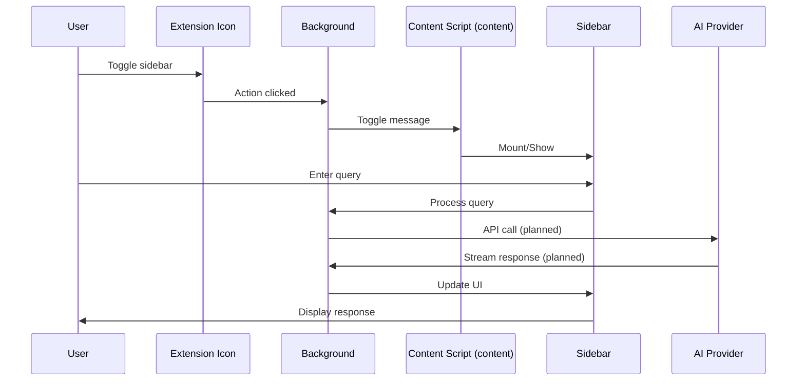

# AI Browser Sidebar Extension - Product Requirements Document

## 1. Executive Summary

A privacy-focused browser extension that enables users to interact with web content through AI-powered chat. Users can capture content from single or multiple browser tabs and query AI models using their own API keys (BYOK - Bring Your Own Key).

**Key Differentiators:**

- Local-first privacy approach (no cloud storage)
- Multi-tab context aggregation
- Provider-agnostic with BYOK model
- One-click content snapshot with all-sites host permission (no intermediary servers)
  - Data is sent only to the user-selected AI provider

## 2. Problem Statement

Knowledge workers spend 2.5 hours daily researching across multiple browser tabs. Current solutions either:

- Require copying content manually to separate AI tools
- Send data through third-party servers (privacy concern)
- Lock users into single AI providers
- Fail to maintain context across multiple sources

**Opportunity:** Create a seamless, private, multi-source AI interaction layer directly in the browser.

**Market Gap:** Current solutions suffer from:

- Feature bloat with rarely-used functionality
- Hidden costs and opaque pricing tiers
- Forced subscriptions for basic features
- Complex UIs that overwhelm users

**Our Approach:**

- Minimalist design with only essential features
- Transparent BYOK model - you only pay for what you use
- No subscriptions, no hidden fees
- Focus on core functionality that users actually need daily

## 3. Feature Specifications

### 3.1 Tab Content Capture System

#### Single Tab Capture

- **Automatic extraction** when sidebar opens (all-sites host permission)
- **Smart content detection**:
  - Article text (main content detection)
  - Code blocks with syntax preservation
  - Tables maintaining structure
  - Selected text with context preservation
- **Dynamic content handling**:
  - MutationObserver for SPAs with debounced re-extraction (300–500ms)
  - Lazy-loaded content detection
  - Infinite scroll pagination with capped iterations and size budgets

- **Selection handling**:
  - Selected text is marked within full content context
  - Non-rendering marker format: `<!-- SEL_START:id --> … <!-- SEL_END:id -->`
  - Markers map to DOM ranges (node path + offset), preserved in export
  - Full page context available to AI; selection can be referenced in queries

- Permissions: requires `<all_urls>` host permission granted at install to enable one-click capture across sites.

#### Multi-Tab Capture

- **Tab selector interface**:
  - `@` trigger for tab search
  - Fuzzy search by title/URL
  - Visual preview (favicon + title)
  - Recently accessed tabs priority
- **Batch extraction**:
  - Parallel content extraction
  - Progress indicators per tab
  - Failure graceful handling
- **Context aggregation**:
  - Maintain source attribution
  - Smart deduplication (shingling/similarity)
  - Relevance ranking (headings, term weights, recency)

#### Content Processing

- **Format preservation**:
  - Markdown conversion
  - Code fence blocks
  - Link references
  - Image URL or alt text (embed or link depending on provider)

#### Content Extraction Strategy

**Content Extraction Approach:**

1. **Core Content (Primary)**:
   - Main article body using Readability algorithm
   - Optional comments/forums for supported sites (configurable)
   - Selected text with context markers
   - Code blocks with syntax preservation
   - Tables and structured data
   - Images (for multimodal models, it should be default, unless a clear non-multimodal model was selected)

2. **Cross-Origin and Media Handling**:
   - Cross-origin iframes/PDF/canvas/shadow DOM: warn user and attempt limited extraction; provide open-in-new-tab option when blocked
   - Images: send URLs when accessible; embed data URIs for same-origin when supported; fall back to alt text/captions; log per-image failures

3. **Format Preservation**:
   - Clean markdown formatting
   - Maintain document structure
   - Preserve links and references
   - Include image URLs/data for multimodal processing

4. **Token Management**:
   - Cache formatted content for efficiency

### 3.2 AI Chat Interface

#### Conversation Management

- **Context window**:
  - Explicit context clearing button or new chat button
  - Tab content persistence per session (session = active sidebar instance)
  - Optional conversation persistence across sessions (local, encrypted at rest)
  - Follow-up questions maintain context
- **Message types**:
  - User queries
  - AI responses
  - System messages (errors, warnings)
  - Source references

#### Input Features

- **Query composition**:
  - Multi-line input support
  - @mention for tab references
- **Quick actions** (optional):
  - Summarize
  - Explain selection
  - Translate to [language]
  - Find differences
  - Custom saved prompts

#### Response Handling

- **Streaming display**:
  - Token-by-token rendering
  - Markdown rendering
  - Syntax highlighting
  - Copy buttons per code block

### 3.3 BYOK (Bring Your Own Key) Management

#### Provider Support

| Provider                   | Models                                | Notes                           |
| -------------------------- | ------------------------------------- | ------------------------------- |
| OpenAI                     | GPT-5, GPT-4.1, o3                    | Response format API, multimodal |
| Google Gemini              | Gemini 2.5 Flash Lite, Gemini 2.5 Pro | Long context, multimodal        |
| Anthropic (via OpenRouter) | Claude Sonnet 4, Claude 3.5 Haiku     | Analysis, coding                |
| Custom                     | OpenAI-compatible endpoints           | Local LLMs, corporate           |

Note: OpenAI should use the Response API.

Common Provider Interface:

- Unified streaming interface and error taxonomy across providers
- Retries with exponential backoff per provider’s guidance
- Reserved schema for tool/function calls to enable structured actions

#### Configuration

- **Multi-model provider settings**:

  ```javascript
  {
    "providers": {
      "openai": {
        "apiKey": "encrypted_key",
        "endpoint": "https://api.openai.com",
        "models": [
          {
            "id": "gpt-5",
            "displayName": "GPT 5",
          },
          {
            "id": "gpt-4.1",
            "displayName": "GPT 4.1",
          },
          {
            "id": "o3",
            "displayName": "o3",
          }
        ],
        "defaultModel": "gpt-5",
        "temperature": 0.6
      },

      "gemini": {
        "apiKey": "encrypted_key",
        "endpoint": "https://generativelanguage.googleapis.com",
        "models": [
          {
            "id": "gemini-2.5-flash-lite",
            "displayName": "Gemini 2.5 Flash Lite",

          },
          {
            "id": "gemini-2.5-pro",
            "displayName": "Gemini 2.5 Pro",
          }
        ],
        "defaultModel": "gemini-2.5-flash-lite"
      }
    },
    "activeProvider": "openai",
    "activeModel": "gpt-5"
  }
  ```

**Model Selection UI:**

- Provider dropdown → Model dropdown (cascading)
- Remember last used per domain

- **Key management**:
  - Encryption at rest (AES-256)
  - Validation on save
  - Local usage tracking (token and cost estimates; user-visible only)
  - Key rotation reminders

## 4. Technical Architecture

### 4.1 Extension Architecture

```
┌─────────────────────────────────────────┐
│         Custom Sidebar UI (React)       │
├─────────────────────────────────────────┤
│          Background Service              │
│  - API calls                            │
│  - State management                     │
│  - Message routing                      │
├─────────────────────────────────────────┤
│          Content Scripts                │
│  - DOM extraction                       │
│  - Selection handling                   │
│  - Dynamic monitoring                   │
├─────────────────────────────────────────┤
│            Storage Layer                │
│  - chrome.storage.local (settings)     │
│  - IndexedDB (conversations)           │
│  - Memory cache (tab content)          │
└─────────────────────────────────────────┘
```

Also supports:

- Custom sidebar for persistent sessions with resize/move capabilities
- Storage retention windows for local caches (e.g., 15 minutes) and a “Clear all data” control

### 4.2 Technology Stack

- **Frontend**: React 18 + TypeScript + Tailwind CSS
- **State Management**: Zustand
- **Build**: Vite + CRXJS
- **Testing**: Vitest + React Testing Library (jsdom)
- **Polyfills**: (none required currently)

### 4.3 Data Flow



## 5. Security & Privacy

### 5.1 Data Handling

- **Zero-logging policy**: No user queries logged
- **Local-only storage**: No cloud sync
- **Encryption**:
  - API keys: AES-256-GCM
  - Cached content: Session-only
  - No persistent conversation storage (MVP)

- Optional anonymized telemetry toggle (default off) with clear list of collected fields

### 5.2 Content Security

- **Blocked domains** (configurable):
  - Banking sites (default list)
  - Healthcare portals
  - Government sites
  - User-defined blocklist
- **Sensitive data detection**:
  - SSN pattern matching
  - Credit card detection
  - Email/phone masking option

### 5.3 API Security

- **Rate limiting**:
  - Per-provider quotas
  - Backoff strategies
  - User notifications
- **Request validation**:
  - Input sanitization
  - Size limits enforcement
  - Injection prevention

## 6. Performance Requirements

### Metrics

| Metric               | Target  | Measurement                  |
| -------------------- | ------- | ---------------------------- |
| Extension load time  | < 100ms | Cold start to UI ready       |
| Content extraction   | < 500ms | DOM to structured text       |
| First token latency  | < 2s    | Query sent to first response |
| Memory usage         | < 50MB  | Baseline memory footprint    |
| Multi-tab extraction | < 3s    | 5 tabs parallel extraction   |

### Optimization Strategies

- Lazy loading of UI components
- Content extraction caching (5 min TTL)
- Request debouncing
- Progressive content loading
- WebWorker for heavy processing

## 7. User Experience

### 7.1 UI Specifications

- **Popup dimensions**:
  - Default: 400x600px
  - Resizable: 350-500px width
  - Full height: 100vh max
- **Theme support**:
  - Auto-detect system theme
  - Light/Dark toggle
  - High contrast mode

- Keyboard shortcuts: open side panel (configurable), send (Cmd/Ctrl+Enter), cycle @-mention tabs

### 7.2 Accessibility

- WCAG 2.1 AA compliance
- Keyboard navigation
- Screen reader support
- Focus indicators
- Reduced motion option

- Define focus order, ARIA roles for chat list and code blocks; ensure high-contrast theme passes WCAG AA

### 7.3 Onboarding Flow

1. **Welcome screen**: Value proposition
2. **Provider selection**: Choose AI provider
3. **API key input**: Secure entry and validation
4. **Test query**: Sample interaction
5. **Success**: Ready to use

## 8. Error Handling

### Error Matrix

| Error Type          | User Message                  | Recovery Action              |
| ------------------- | ----------------------------- | ---------------------------- |
| Extraction failed   | "Unable to read page content" | Retry with fallback method   |
| API key invalid     | "Check your API key"          | Link to settings             |
| Rate limit exceeded | "Too many requests"           | Show cooldown timer          |
| Network timeout     | "Connection issue"            | Retry button                 |
| Content too large   | "Content exceeds limit"       | Offer truncation options     |
| Provider error      | "AI service unavailable"      | Suggest alternative provider |

## 9. Success Metrics

### Primary KPIs

- **Activation rate**: 50% complete first query
- **Retention**: 30% WAU/MAU ratio
- **Engagement**: 5 queries per session average
- **Performance**: 95% queries < 5s total time

### Secondary Metrics

- Provider distribution
- Feature usage (multi-tab vs single)
- Error rates by type
- Average context size
- Query complexity distribution

## 10. Testing Strategy

### Test Coverage

- **Unit tests**: 90% coverage
- **Integration tests**: Critical paths
- **E2E tests**: User journeys
- **Performance tests**: Load testing
- **Security tests**: Penetration testing

### Browser Compatibility

- Chrome 120+
- Edge 120+
- Brave latest
- Opera latest
- Arc Browser latest

### Test Scenarios

1. Single tab extraction on news site
2. Multi-tab with 10+ tabs
3. SPA content extraction
4. API key rotation
5. Provider switching mid-conversation
6. Large content truncation
7. Network failure recovery

### B. References

- [Chrome Extension Manifest V3](https://developer.chrome.com/docs/extensions/mv3/)
- [OpenAI API Documentation](https://platform.openai.com/docs)
- [Anthropic Claude API](https://docs.anthropic.com/claude/reference)
- [Web Content Extraction Best Practices](https://github.com/postlight/mercury-parser)

### C. Technical Dependencies

```json
{
  "dependencies": {
    "@types/chrome": "^0.0.260",
    "react": "^18.2.0",
    "zustand": "^4.4.7",
    "webextension-polyfill": "^0.10.0",
    "openai": "^4.24.0",
    "@anthropic-ai/sdk": "^0.9.0"
  }
}
```

---

_Document Version: 1.0_  
_Last Updated: 2025-08-19_  
_Owner: Product Team_  
_Status: In Review_
