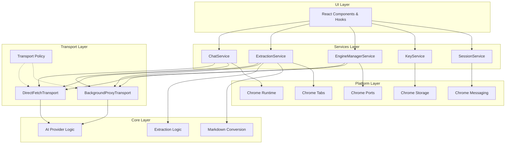
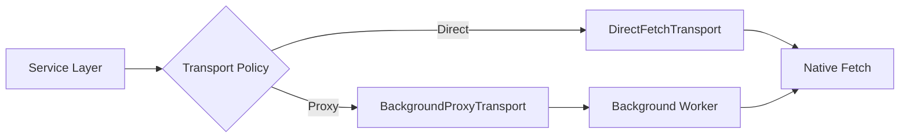
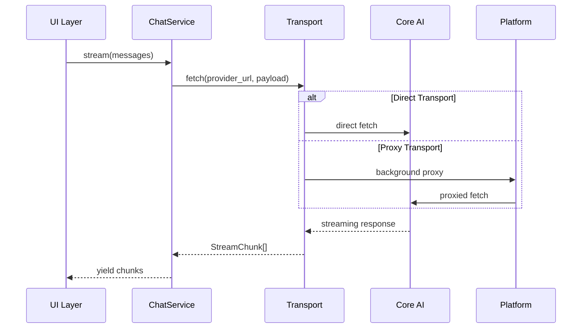
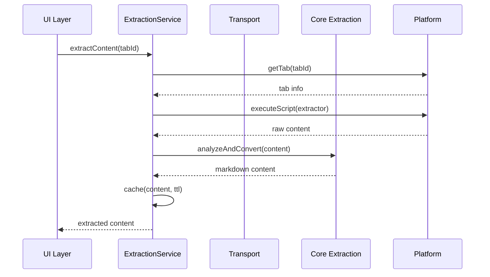

# Browser Sidebar Extension - Modular Architecture

## Overview

The Browser Sidebar Extension has been refactored from a monolithic architecture to a clean, modular, service-oriented design. This new architecture provides better separation of concerns, testability, and maintainability while maintaining backward compatibility through a feature flag system.

## Architecture Layers

The refactored architecture consists of five distinct layers, each with specific responsibilities:



## Layer Details

### 1. UI Layer (`src/sidebar/`)

**Responsibility**: User interface and interaction handling

**Key Components**:

- React components for chat interface, settings, and content preview
- Custom hooks that delegate to services (no direct browser API calls)
- State management for UI-specific concerns

**Principles**:

- Thin layer that focuses purely on UI concerns
- No business logic or direct API calls
- Delegates all complex operations to services
- Maintains only UI-specific state

**Example Hook Pattern**:

```typescript
// Old monolithic approach
export function useChat() {
  const [provider, setProvider] = useState<AIProvider | null>(null);

  const stream = async function* (messages: Message[]) {
    // Direct provider interaction, CORS handling, etc.
    const response = await fetch(/* complex logic */);
    // Stream processing logic...
  };
}

// New service-oriented approach
export function useChat() {
  const chatService = useMemo(() => createChatService(), []);

  const stream = useCallback(
    async function* (messages: Message[]) {
      yield* chatService.stream(messages);
    },
    [chatService]
  );
}
```

### 2. Services Layer (`src/services/`)

**Responsibility**: Business orchestration and high-level operations

This layer provides clean, testable interfaces for complex business operations:

#### ChatService

- Manages AI chat streaming with any configured provider
- Handles request cancellation via AbortController
- Provides consistent StreamChunk format across providers
- Integrates with transport layer for CORS handling

```typescript
interface IChatService {
  stream(messages: ProviderChatMessage[], options?: StreamOptions): AsyncIterable<StreamChunk>;
  cancel(): void;
  isStreaming(): boolean;
  setProvider(provider: AIProvider): void;
}
```

#### ExtractionService

- Orchestrates content extraction from web pages
- Manages extraction caching with configurable TTL
- Handles multi-tab content aggregation
- Coordinates between extraction logic and transport

#### EngineManagerService

- Manages AI provider lifecycle and configuration
- Handles provider switching and initialization
- Coordinates API key validation with providers
- Maintains provider registry and factory patterns

#### KeyService

- Manages API key storage with AES-GCM encryption
- Provides key validation for different providers
- Handles secure key retrieval and updates
- Abstracts Chrome storage complexity

#### SessionService

- Manages tab-specific session state
- Tracks conversation context per tab
- Handles session persistence and cleanup
- Coordinates with Chrome tabs API through platform layer

### 3. Transport Layer (`src/transport/`)

**Responsibility**: HTTP request abstraction and routing

The transport layer solves CORS issues by providing pluggable HTTP implementations:



#### DirectFetchTransport

- Uses native `fetch()` for standard requests
- Suitable for APIs without CORS restrictions
- Minimal overhead, direct browser networking

#### BackgroundProxyTransport

- Routes requests through background service worker
- Bypasses CORS restrictions for problematic APIs
- Maintains same interface as DirectFetchTransport

#### Transport Policy

- Intelligent routing based on domain patterns
- Configurable allowlist/denylist for proxy decisions
- Supports pattern matching and subdomain handling

```typescript
// Automatic CORS handling
const transport = shouldProxy(url) ? new BackgroundProxyTransport() : new DirectFetchTransport();

await transport.fetch(url, options);
```

### 4. Core Layer (`src/core/`)

**Responsibility**: Pure business logic with no browser dependencies

This layer contains the "brain" of the application - complex algorithms and business rules that are completely independent of the browser environment:

#### AI Provider Logic (`src/core/ai/`)

- **OpenAI**: GPT models with response API support
- **Gemini**: Google's Gemini 2.5 series with thinking mode
- **OpenRouter**: Multi-provider access through single API
- **OpenAI-Compatible**: Generic providers using OpenAI format

Each provider includes:

- Request building and validation
- Response parsing and streaming
- Error handling and recovery
- Provider-specific optimizations

#### Extraction Logic (`src/core/extraction/`)

- Content analysis and structure detection
- Text cleaning and normalization algorithms
- Intelligent content filtering

#### Markdown Conversion

- HTML-to-Markdown conversion with fidelity preservation
- Table structure preservation
- Link and image handling
- Code block detection and formatting

**Key Principle**: All core modules can run in any JavaScript environment (Node.js, browser, worker) without modification.

### 5. Platform Layer (`src/platform/`)

**Responsibility**: Browser API abstraction

Provides clean, typed interfaces to Chrome extension APIs:

#### Chrome Runtime (`src/platform/chrome/runtime.ts`)

- Extension lifecycle management
- Message passing utilities
- Error handling and logging

#### Chrome Storage (`src/platform/chrome/storage.ts`)

- Typed storage operations
- Async/await interface
- Storage quota management

#### Chrome Tabs (`src/platform/chrome/tabs.ts`)

- Tab management and queries
- Content script injection
- Tab state tracking

#### Chrome Messaging (`src/platform/chrome/messaging.ts`)

- Inter-component communication
- Message routing and validation
- Port-based communication

#### Chrome Ports (`src/platform/chrome/ports.ts`)

- Long-lived connection management
- Background-content script communication
- Connection lifecycle handling

**Benefits**:

- Easy to mock for testing
- Consistent error handling
- Type safety for Chrome APIs
- Simplified API surface

## Data Flow

### Chat Flow



### Content Extraction Flow



## Migration Note

Earlier versions used a `refactorMode` feature flag for a staged rollout. The flag has been removed; the modular architecture (services + transport + platform) is now the default in all builds.

## Benefits of the New Architecture

### Separation of Concerns

- **UI Layer**: Only handles user interaction and display
- **Services**: Focus on business orchestration
- **Core**: Pure business logic, highly testable
- **Platform**: Clean browser API abstraction
- **Transport**: HTTP concerns completely isolated

### Testability

- Each layer can be tested independently
- Core modules have zero dependencies
- Services can be mocked easily
- Platform abstraction enables complete unit testing

### Maintainability

- Clear boundaries between responsibilities
- Easy to locate and modify specific functionality
- Reduced coupling between components
- Consistent error handling patterns

### Scalability

- New providers add to core layer only
- New transports plug in seamlessly
- Services can be extended without UI changes
- Platform layer supports multiple browser types

### Performance

- Intelligent transport routing reduces latency
- Service layer enables efficient caching strategies
- Core modules are optimized for specific tasks
- Platform abstractions eliminate redundant operations

## Migration Strategy

### Phase 1-3: Foundation ✅

- Built core services (ChatService, ExtractionService, etc.)
- Implemented transport abstraction
- Created platform wrappers

### Phase 4-6: Integration ✅

- Connected services to existing UI
- Implemented feature flag switching
- Added comprehensive testing

### Phase 7-8: Optimization ✅

- Performance tuning and caching
- Error handling improvements
- Documentation and examples

### Phase 9: Documentation ✅

- Architecture documentation (this document)
- Developer guides and examples
- Migration recommendations

## Future Extensibility

The modular architecture provides clear extension points:

### Adding New AI Providers (Engines)

1. Implement core API logic in `src/core/ai/[provider]/` (request builder, stream processor, error mapper).
2. Add an engine under `src/core/engine/[Provider]Provider.ts` that adapts the core logic to the common provider interface.
3. Register in `src/core/engine/EngineFactory.ts` so `EngineManagerService` can instantiate it.
4. If the endpoint is CORS‑restricted, update `@transport/policy` with an allowlist entry so `shouldProxy(url)` routes via the background proxy.
5. No UI changes required — hooks call services which select the active engine.

### Adding New Transport Methods

1. Implement Transport interface in `src/transport/`
2. Update policy routing logic
3. Services automatically benefit from new transport

### Adding New Services

1. Implement service interface in `src/services/[service]/`
2. Create corresponding UI hooks in `src/sidebar/hooks/`
3. Add platform abstractions if needed
4. Register with dependency injection system

## Development Guidelines

### Service Development

- Keep services focused on orchestration, not implementation
- Use dependency injection for platform and transport dependencies
- Implement comprehensive error handling
- Provide clear TypeScript interfaces

### Core Module Development

- No browser-specific dependencies
- Pure functions where possible
- Comprehensive unit testing
- Clear input/output contracts

### Platform Abstraction

- Mirror Chrome API structure but with better types
- Handle all Chrome API quirks internally
- Provide consistent async/await interfaces
- Include proper error handling

### Transport Implementation

- Implement the Transport interface exactly
- Handle all HTTP concerns (headers, status codes, errors)
- Support request/response interceptors
- Provide proper streaming support

## Conclusion

The new modular architecture transforms the Browser Sidebar Extension from a monolithic structure into a clean, maintainable, and extensible system. Each layer has clear responsibilities, making the codebase easier to understand, test, and extend. The feature flag system ensures a safe migration path while the transport abstraction solves complex CORS issues elegantly.

This architecture provides a solid foundation for future development while maintaining the extension's core functionality and user experience.
