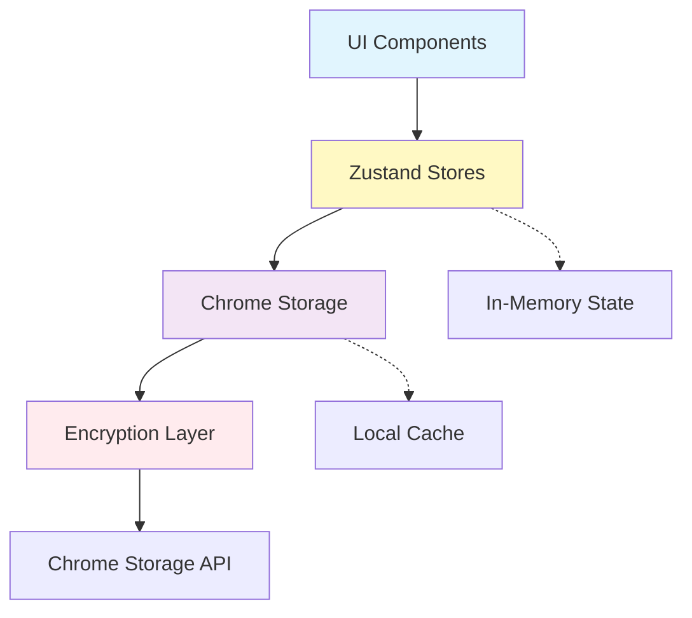

# Data Layer Architecture

The data layer provides a comprehensive solution for state management, persistence, and security in the AI Browser Sidebar Extension. It implements a layered architecture that separates concerns while maintaining type safety and performance.

## Table of Contents

- [Architecture Overview](#architecture-overview)
- [Directory Structure](#directory-structure)
- [Core Modules](#core-modules)
- [Implementation Details](#implementation-details)
- [API Reference](#api-reference)
- [Usage Examples](#usage-examples)
- [Security Considerations](#security-considerations)
- [Performance Optimization](#performance-optimization)
- [Error Handling](#error-handling)
- [Testing Strategy](#testing-strategy)
- [Migration Guide](#migration-guide)

## Architecture Overview



### Design Principles

1. **Separation of Concerns**: Each layer has a single responsibility
2. **Type Safety**: Full TypeScript coverage with strict typing
3. **Performance First**: Optimistic updates, caching, and batch operations
4. **Security by Default**: Automatic encryption for sensitive data
   5.ессия **Reactive Updates**: Immediate UI feedback through Zustand
5. **Graceful Degradation**: Fallback mechanisms for storage failures

## Directory Structure

```
data/
├── store/                    # State management layer
│   ├── chat.ts              # Chat conversations and messages
│   ├── settings.ts          # User preferences and API keys
│   └── types.ts             # Shared store type definitions
├── storage/                  # Persistence layer
│   ├── keys/                # API key management
│   │   ├── manager.ts       # Key storage orchestration
│   │   ├── validator.ts     # API key validation
│   │   └── types.ts         # Key-related types
│   ├── chrome.ts            # Chrome Storage API wrapper
│   ├── migrations.ts        # Data migration utilities
│   └── types.ts             # Storage type definitions
├── security/                 # Security layer
│   ├── crypto.ts            # AES-GCM encryption implementation
│   ├── keychain.ts          # Secure key derivation
│   └── sanitizer.ts         # Input sanitization
└── index.ts                 # Public API exports
```

## Core Modules

### Store Module (`/store`)

#### Chat Store (`chat.ts`)

Manages all chat-related state including conversations, messages, and streaming responses.

**Key Features:**

- Message history management with pagination
- Real-time streaming state updates
- Conversation branching support
- Token usage tracking
- Error recovery mechanisms

**State Shape:**
Manages conversations, active conversation ID, messages array, streaming state, token usage tracking, and error handling.

#### Settings Store (`settings.ts`)

Manages user preferences, API keys, and application configuration.

**Key Features:**

- Multi-provider API key management
- Theme and appearance settings
- Model preferences per provider
- Privacy settings
- Export/import configuration

**State Shape:**
Manages API keys by provider, theme preferences, default model configuration, provider-specific model preferences, privacy settings, and experimental feature flags.

### Storage Module (`/storage`)

#### Chrome Storage Wrapper (`chrome.ts`)

Type-safe wrapper around Chrome Storage API with automatic serialization.

**Features:**

- Automatic JSON serialization/deserialization
- Batch operations for performance
- Storage quota management
- Change listeners with debouncing
- Migration support for schema changes

**Storage Areas:**

- `local`: Large data (conversations, cache)
- `sync`: User settings (synced across devices)
- `session`: Temporary data (current session only)

#### Key Manager (`keys/manager.ts`)

Orchestrates API key storage with encryption and validation.

**Security Features:**

- Automatic encryption before storage
- Key rotation support
- Access audit logging
- Secure deletion with memory clearing
- Provider-specific validation

### Security Module (`/security`)

#### Encryption (`crypto.ts`)

Implements AES-GCM encryption with WebCrypto API.

**Implementation Details:**

- 256-bit AES keys
- Random IV generation per encryption
- PBKDF2 key derivation from user passphrase
- Constant-time comparison for authentication
- Memory clearing after operations

**Encryption Flow:**
Data flows from plaintext through key derivation, IV generation, encryption, base64 encoding to storage. Decryption reverses this process with base64 decoding, IV-based decryption, verification, and plaintext recovery.

#### Sanitization (`sanitizer.ts`)

Input validation and sanitization for security.

**Capabilities:**

- XSS prevention for user inputs
- SQL injection prevention
- Path traversal protection
- Content Security Policy enforcement
- Rate limiting for API calls

## Implementation Details

### State Management Pattern

Implements Zustand store with devtools, persistence, and Immer middleware for immutable state updates. Includes state properties, action methods, and computed values with automatic storage synchronization.

### Storage Adapter Pattern

Chrome Storage adapter for Zustand provides async getItem, setItem, and removeItem methods that interface with chrome.storage.local API for persistent state management.

### Encryption Implementation

CryptoService class implements secure key derivation using PBKDF2 with 100,000 iterations and SHA-256 hashing. Encryption uses AES-GCM with random salt and IV generation, returning base64-encoded encrypted data, salt, and IV.

## API Reference

### Chat Store API

**Message operations:** addMessage, updateMessage, deleteMessage, clearMessages

**Streaming operations:** startStreaming, appendToStream, endStreaming for real-time message updates

**Conversation operations:** createConversation, switchConversation, deleteConversation, exportConversation for conversation management

### Settings Store API

**API key operations:** setApiKey, removeApiKey, validateApiKey for secure key management

**Preference operations:** updateTheme, setDefaultModel, updatePrivacySettings for user customization

**Import/Export:** exportSettings, importSettings, resetToDefaults for data portability

### Storage API

**Basic operations:** saveToStorage, loadFromStorage, removeFromStorage with optional storage area selection

**Batch operations:** batchSave, batchLoad for efficient multi-item operations

**Listeners:** onStorageChange for reactive updates to storage modifications

## Usage Examples

_Code examples have been removed for brevity. Please refer to the implementation files for usage patterns._

## Security Considerations

### API Key Security

1. **Never store plaintext**: All API keys are encrypted before storage
2. **Memory clearing**: Sensitive data is cleared from memory after use
3. **Access logging**: All key access is logged for audit
4. **Rotation support**: Keys can be rotated without data loss
5. **Secure deletion**: Keys are overwritten before deletion

### Data Protection

1. **Encryption at rest**: All sensitive data is encrypted in storage
2. **Transport security**: HTTPS only for external communications
3. **Input validation**: All user inputs are sanitized
4. **XSS prevention**: Content Security Policy enforcement
5. **CSRF protection**: Token validation for state changes

### Privacy Guidelines

1. **Local first**: Data stays on device unless explicitly shared
2. **No telemetry**: No automatic data collection
3. **User control**: Full data export and deletion capabilities
4. **Transparent storage**: Users can inspect all stored data
5. **Consent required**: Explicit consent for any data sharing

## Performance Optimization

### Caching Strategy

Implement in-memory cache with TTL (Time To Live) for frequently accessed storage items. Cache entries expire after a configured duration, falling back to storage retrieval and cache refresh.

### Batch Operations

Debounce multiple storage writes into single batch operations to improve performance. Pending writes are collected and executed together after a configurable delay.

### Memory Management

1. **Pagination**: Load messages in chunks
2. **Virtualization**: Only render visible messages
3. **Cleanup**: Remove old conversations periodically
4. **Compression**: Compress large conversation exports
5. **Lazy loading**: Load data only when needed

## Error Handling

### Storage Errors

Custom StorageError class with error codes and recoverability flags. Robust save operations include retry logic with exponential backoff, quota exceeded handling through data cleanup, and graceful failure reporting.

### Recovery Mechanisms

1. **Automatic retry**: Transient failures retry with backoff
2. **Fallback storage**: Use session storage if local fails
3. **Data recovery**: Restore from backups on corruption
4. **Graceful degradation**: Continue with reduced functionality
5. **User notification**: Inform user of persistent issues

## Testing Strategy

### Unit Tests

Test individual store operations like message addition and verify state changes. Test storage persistence by mocking Chrome storage APIs and verifying correct serialization and storage calls.

### Integration Tests

Test complete workflows across multiple modules, such as encrypted API key storage and retrieval. Verify that encryption is applied and that stored data differs from plaintext while retrieved data matches original input.

## Migration Guide

### From v1 to v2

Migration process transforms old message format into conversation-based structure. Retrieves all existing data, restructures into new format with conversations array, clears old storage, and saves transformed data.

### Breaking Changes

- **v2.0**: Changed message format to support conversations
- **v2.1**: Encrypted API keys (automatic migration)
- **v2.2**: Added provider-specific settings
- **v3.0**: Moved to Zustand from Redux (compatibility layer provided)

## Best Practices

### Do's

- ✅ Always encrypt sensitive data
- ✅ Use batch operations for multiple updates
- ✅ Implement proper error handling
- ✅ Clean up old data periodically
- ✅ Test storage quota limits
- ✅ Provide data export functionality
- ✅ Use TypeScript for type safety
- ✅ Implement proper logging

### Don'ts

- ❌ Store plaintext passwords or API keys
- ❌ Block UI on storage operations
- ❌ Assume storage operations succeed
- ❌ Store large blobs without compression
- ❌ Mix storage areas unnecessarily
- ❌ Ignore storage change events
- ❌ Trust user input without validation
- ❌ Leak sensitive data in errors

## Troubleshooting

### Common Issues

**Issue**: Storage quota exceeded
**Solution**: Implement cleanup by sorting conversations by last accessed time and keeping only the most recent ones.

**Issue**: Slow storage operations
**Solution**: Use batch operations and in-memory caching with fallback to storage for cache misses.

**Issue**: Data corruption
**Solution**: Implement validation and recovery by checking data schema and falling back to backup data when validation fails.

## Future Enhancements

### Planned Features

1. **IndexedDB Support**: For larger data storage needs
2. **Sync Conflict Resolution**: Better handling of sync conflicts
3. **Compression**: Automatic compression for large data
4. **Versioned Backups**: Automatic backup with version history
5. **Analytics**: Privacy-preserving usage analytics
6. **Real-time Sync**: WebSocket-based real-time synchronization
7. **Offline Support**: Full offline capability with sync queue
8. **Data Portability**: Import/export in standard formats

### Experimental Features

Enable in settings to test upcoming features:

- IndexedDB storage for large data sets
- Data compression for stored data
- Real-time synchronization
- Advanced encryption methods

## Contributing

### Development Setup

- Install dependencies: `npm install`
- Run tests: `npm run test:data`
- Build: `npm run build`
- Watch mode: `npm run dev`

### Code Standards

- TypeScript strict mode enabled
- 100% type coverage required
- Unit tests for all public APIs
- Integration tests for critical paths
- Documentation for public interfaces

## License

This module is part of the AI Browser Sidebar Extension and follows the project's MIT license.
