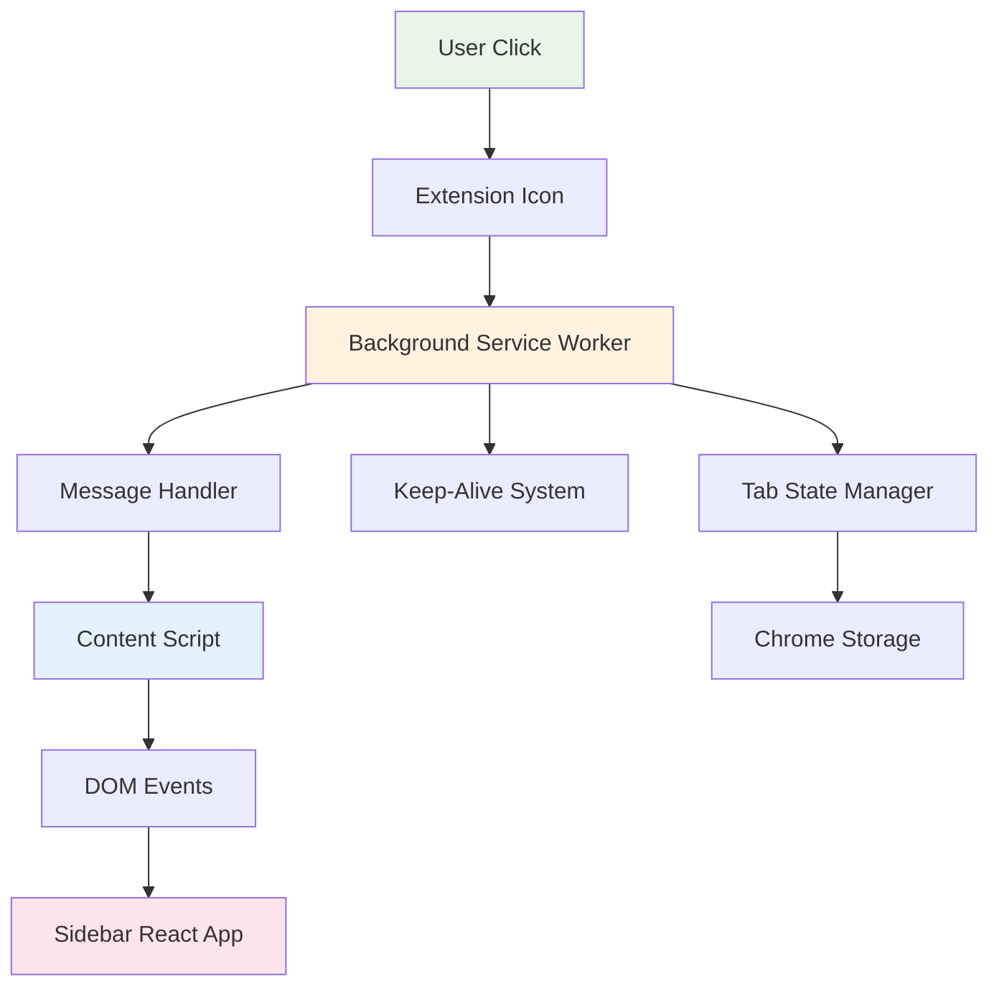
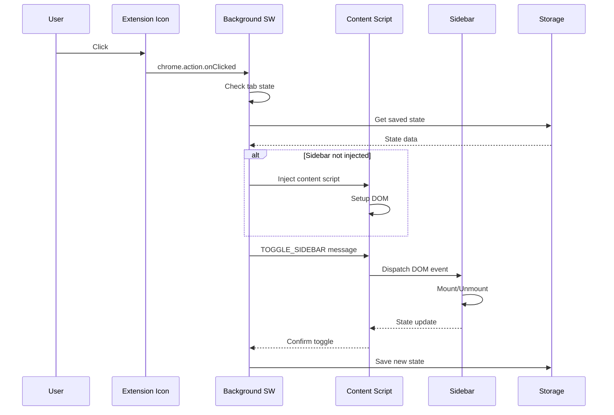

# Extension Infrastructure

The extension infrastructure layer implements the core Chrome Extension functionality, providing service worker capabilities, message passing, and cross-tab state management for the AI Browser Sidebar Extension.

## Table of Contents

- [Architecture Overview](#architecture-overview)
- [Directory Structure](#directory-structure)
- [Core Components](#core-components)
- [Message Flow](#message-flow)
- [Service Worker Lifecycle](#service-worker-lifecycle)
- [Implementation Details](#implementation-details)
- [API Reference](#api-reference)
- [Usage Examples](#usage-examples)
- [Security & Permissions](#security--permissions)
- [Debugging Guide](#debugging-guide)
- [Performance Optimization](#performance-optimization)
- [Browser Compatibility](#browser-compatibility)
- [Common Issues & Solutions](#common-issues--solutions)
- [Testing Strategy](#testing-strategy)
- [Future Enhancements](#future-enhancements)

## Architecture Overview



### Design Principles

1. **Event-Driven Architecture**: Reactive to user actions and browser events
2. **Stateless Service Worker**: No persistent in-memory state
3. **Message-Based Communication**: Loose coupling between components
4. **Tab Isolation**: Each tab has independent sidebar state
5. **Fault Tolerance**: Graceful handling of service worker restarts
6. **Performance First**: Minimal overhead, lazy loading

## Directory Structure

```
extension/
├── background/              # Service worker components
│   ├── index.ts            # Service worker entry point
│   ├── keepAlive.ts        # Keep-alive mechanism
│   ├── messageHandler.ts   # Central message routing
│   └── sidebarManager.ts   # Tab-specific state management
├── messaging/              # Message passing utilities
│   ├── types.ts           # Message type definitions
│   ├── sender.ts          # Message sending utilities
│   └── listener.ts        # Message listener utilities
├── permissions/            # Permission management
│   ├── checker.ts         # Permission verification
│   └── requester.ts       # Dynamic permission requests
└── manifest.json          # Extension manifest (v3)
```

## Core Components

### Background Service Worker (`background/`)

The background service worker acts as the central coordinator for the extension, handling:

#### Entry Point (`index.ts`)

The main service worker file that orchestrates all background operations.

**Responsibilities:**

- Initialize extension on install/update
- Register message listeners
- Set up action handlers
- Manage service worker lifecycle

**Key Features:**

- Service worker initialization with install/update handling
- Action click handler for sidebar toggle
- Automatic migration logic for version updates

#### Keep-Alive Mechanism (`keepAlive.ts`)

Prevents service worker from being terminated during long operations.

**Implementation:**

- Creates persistent connection via Chrome runtime port
- Sends periodic pings every 25 seconds
- Cleanly disconnects when no longer needed

**When to Use:**

- During API key validation
- While processing large content extractions
- During file downloads/uploads
- When maintaining WebSocket connections

#### Message Handler (`messageHandler.ts`)

Central hub for all message routing between extension components.

**Message Types:**

- `TOGGLE_SIDEBAR` - Show/hide sidebar
- `CLOSE_SIDEBAR` - Force close sidebar
- `UPDATE_STATE` - Persist state changes
- `CONTENT_EXTRACTED` - Page content ready
- `API_KEY_SAVED` - API key updated
- `MODEL_CHANGED` - AI model selection changed
- `ERROR_OCCURRED` - Error reporting

**Routing Logic:**

- Maps message types to specific handlers
- Provides centralized error handling
- Returns structured error responses
- Supports async message processing

#### Sidebar Manager (`sidebarManager.ts`)

Manages sidebar state across all tabs.

**State Management:**

- Maintains per-tab sidebar state (open/closed, position, size)
- Automatically injects content script when needed
- Persists state across browser sessions
- Handles tab cleanup on navigation/close

### Messaging System (`messaging/`)

Type-safe message passing between extension components.

#### Message Types (`types.ts`)

Defines type-safe message interfaces for all extension communication:

- Base message interface with id, type, payload, timestamp, and source
- Specific message types for sidebar toggle, content extraction, API keys, and errors
- Union type for all extension messages ensuring type safety

#### Message Sender (`sender.ts`)

Provides utilities for sending messages:

- `sendToTab()` - Send message to specific tab
- `sendToBackground()` - Send message to background service worker
- `broadcast()` - Send message to all open tabs
- Automatic ID generation and timestamp addition

### Permission Management (`permissions/`)

Dynamic permission handling for enhanced security:

- Check if permissions are currently granted
- Request permissions from user when needed
- Monitor permission changes in real-time
- Handle permission additions and removals
- Provide notifications for permission state changes

## Message Flow

### Complete Message Flow Example



### Message Types and Handlers

| Message Type        | Source     | Target     | Purpose           |
| ------------------- | ---------- | ---------- | ----------------- |
| `TOGGLE_SIDEBAR`    | Background | Content    | Show/hide sidebar |
| `SIDEBAR_READY`     | Content    | Background | Sidebar loaded    |
| `EXTRACT_CONTENT`   | Sidebar    | Content    | Get page content  |
| `CONTENT_EXTRACTED` | Content    | Sidebar    | Return content    |
| `UPDATE_STATE`      | Sidebar    | Background | Persist state     |
| `API_KEY_SAVED`     | Background | All tabs   | Key updated       |
| `ERROR_OCCURRED`    | Any        | Background | Error reporting   |

## Service Worker Lifecycle

### Lifecycle Events

**Supported Events:**

- `onInstalled` - Handle first install, updates, and browser updates
- `onStartup` - Initialize extension when browser starts
- `onSuspend` - Save state before service worker termination
- `onConnect` - Handle persistent connections and keep-alive

### State Persistence

**Features:**

- Debounced saves to prevent excessive writes (500ms delay)
- Primary storage in `chrome.storage.local`
- Automatic fallback to `chrome.storage.session` on errors
- Timestamp tracking for last save
- Graceful error handling and recovery

## Implementation Details

### Tab State Management

**TabState Interface:**

- Tab identification (id, url, title)
- Sidebar state (open/closed, injected, position, size)
- Content extraction state (extracted, timestamp, hash)

**TabStateManager Features:**

- Initialize state for new tabs
- Track sidebar injection status
- Clean up state on tab close
- Reset state on navigation
- Maintain content extraction history

### Content Script Injection

**ContentScriptInjector Features:**

- Track injected tabs to prevent duplicate injections
- Check URL eligibility before injection
- Inject both JavaScript and CSS files
- Handle restricted URLs (chrome://, edge://, about:)
- Check file:// URL access permissions
- Graceful error handling with detailed logging

### Error Handling

**ExtensionErrorHandler Features:**

- Maintain error queue with size limit (100 errors max)
- Classify errors by type (runtime, message, permission, network)
- Track error context and stack traces
- Identify and report critical errors
- Broadcast critical errors to all tabs
- Automatic queue trimming to prevent memory issues

## API Reference

### Background Service Worker API

**Sidebar Operations:**

- `toggleSidebar(tabId)` - Toggle sidebar visibility
- `openSidebar(tabId)` - Open sidebar
- `closeSidebar(tabId)` - Close sidebar
- `isSidebarOpen(tabId)` - Check sidebar state

**State Management:**

- `saveTabState(tabId, state)` - Save tab state
- `getTabState(tabId)` - Retrieve tab state
- `clearTabState(tabId)` - Clear tab state
- `getAllTabStates()` - Get all tab states

**Message Handling:**

- `sendMessage(tabId, message)` - Send to specific tab
- `broadcast(message)` - Send to all tabs
- `onMessage(handler)` - Register message handler

**Permission Management:**

- `requestPermission(permission)` - Request permission
- `hasPermission(permission)` - Check permission
- `getAllPermissions()` - List all permissions

### Content Script Communication

**Message Flow Patterns:**

- Content → Background: Use `chrome.runtime.sendMessage()`
- Background → Content: Use `chrome.tabs.sendMessage()`
- Always return `true` in listeners for async responses
- Include structured response with success/error status

## Usage Examples

### Complete Extension Setup

Setup involves importing core components (SidebarManager, MessageHandler, KeepAlive), handling install events with welcome page display, managing extension icon clicks for sidebar toggling, setting up message routing with error handling, and handling tab lifecycle events for state management.

### Dynamic Permission Request

Implement permission checking, user permission requests, and graceful handling of permission denials. Pattern includes checking existing permissions, requesting when needed, and providing fallback behavior for denied permissions.

## Security & Permissions

### Manifest Permissions

**Required Permissions:**

- `storage` - Store user settings
- `activeTab` - Access current tab

**Optional Permissions:**

- `clipboardWrite` - Copy to clipboard
- `downloads` - Export conversations
- `notifications` - Show notifications

**Host Permissions:**

- `<all_urls>` - Inject into any page

**Content Security Policy:**

- Extension pages use strict CSP with self-only scripts

### Security Best Practices

1. **Minimal Permissions**: Request only necessary permissions
2. **Dynamic Permissions**: Use optional_permissions for features
3. **Input Validation**: Sanitize all external inputs
4. **CSP Enforcement**: Strict Content Security Policy
5. **Secure Communication**: Validate message sources
6. **No Eval**: Never use eval() or Function()
7. **HTTPS Only**: Enforce secure connections

### Message Validation

MessageValidator class implements comprehensive message validation with trusted origin checking, sender validation, message structure validation, and message type verification. Provides security through origin whitelisting and structured validation.

## Debugging Guide

### Chrome DevTools

**Debug Logging:** Enable verbose logging with DEBUG flag and centralized log function. Add debug information to messages including timestamps, stack traces, and tab IDs.

**DevTools Access:** Open chrome://extensions, enable Developer mode, and click "Inspect views: service worker" to access DevTools Console, Network, and Sources tabs.

### Service Worker Debugging

1. Open `chrome://extensions`
2. Enable Developer mode
3. Click "Inspect views: service worker"
4. Use DevTools Console, Network, Sources tabs

### Common Debugging Commands

**Service Worker Console Commands:**

- Query tab states with `chrome.tabs.query()`
- Test message sending with `chrome.tabs.sendMessage()`
- Check permissions with `chrome.permissions.getAll()`
- View storage data with `chrome.storage.local.get()`
- Monitor messages with `chrome.runtime.onMessage.addListener()`

## Performance Optimization

### Lazy Loading

LazyLoader class implements module-level lazy loading with promise caching. Prevents duplicate module loads through Map-based promise storage and provides dynamic import routing for different module types.

### Memory Management

MemoryManager class implements LRU (Least Recently Used) cache eviction with size tracking. Automatically evicts oldest entries when cache size exceeds limits, maintains current size tracking, and provides efficient memory utilization.

## Browser Compatibility

### Supported Browsers

| Browser | Minimum Version | Notes                              |
| ------- | --------------- | ---------------------------------- |
| Chrome  | 88+             | Full support                       |
| Edge    | 88+             | Full support                       |
| Arc     | Latest          | Full support, custom sidebar works |
| Brave   | Latest          | Full support                       |
| Opera   | 74+             | Full support                       |
| Vivaldi | 3.6+            | Full support                       |

### Browser-Specific Handling

BrowserAdapter class detects browser type through user agent parsing, provides version extraction for different browsers, and checks for native API availability. Handles Arc browser's lack of sidePanel API support.

## Common Issues & Solutions

### Issue: Service Worker Stops Responding

**Symptom**: Extension becomes unresponsive after period of inactivity

**Solution**: Implement ServiceWorkerKeepAlive class with chrome.alarms API. Creates periodic alarm that fires every minute to perform lightweight storage operations, preventing service worker termination.

### Issue: Content Script Not Injecting

**Symptom**: Sidebar doesn't appear on certain pages

**Solution**: Enhanced injection with fallbacks. Try programmatic injection via chrome.scripting.executeScript first, then fallback to dynamic script element creation if primary method fails. Provides error handling and detailed logging.

### Issue: Message Passing Fails

**Symptom**: Messages not reaching destination

**Solution**: Robust message sending with exponential backoff retry logic. Automatically re-injects content script when connection establishment fails, provides configurable retry limits, and handles transient network issues.

## Testing Strategy

### Unit Tests

Test individual components like MessageHandler with mocked Chrome APIs. Verify message routing, response handling, and API interaction through Jest spy functions and assertion checking.

### Integration Tests

Test complete user workflows like sidebar toggling from icon click through state verification. Simulate browser events, verify state changes, and confirm message passing between components.

## Future Enhancements

### Planned Features

1. **WebSocket Support**: Real-time communication channel
2. **Offline Mode**: Full offline functionality with sync
3. **Cross-Device Sync**: Sync state across devices
4. **Custom Shortcuts**: User-defined keyboard shortcuts
5. **Theme System**: Custom themes and appearance
6. **Extension API**: Allow third-party integrations
7. **Performance Metrics**: Built-in performance monitoring
8. **A/B Testing**: Feature flag system

### Experimental APIs

Feature flag system for enabling experimental functionality:

- WebSocket support for real-time communication
- Offline mode with sync capabilities
- Custom keyboard shortcuts
- Built-in performance metrics

Features are disabled by default and can be enabled through configuration flags.

## Contributing

### Development Setup

Repository setup:

1. Clone repository and navigate to directory
2. Install dependencies with `npm install`
3. Build extension with `npm run build`
4. Use watch mode for development with `npm run watch`
5. Run tests with `npm test`

### Code Standards

- TypeScript strict mode enabled
- ESLint configuration enforced
- Prettier for code formatting
- Jest for testing
- 80% minimum test coverage

### Extension Architecture Principles

1. **Stateless Service Worker**: No persistent memory state
2. **Message-Based**: All communication via messages
3. **Tab Isolation**: Each tab independent
4. **Fail-Safe**: Graceful error handling
5. **Performance**: Minimal overhead
6. **Security**: Least privilege principle

## License

This module is part of the AI Browser Sidebar Extension and follows the project's MIT license.
