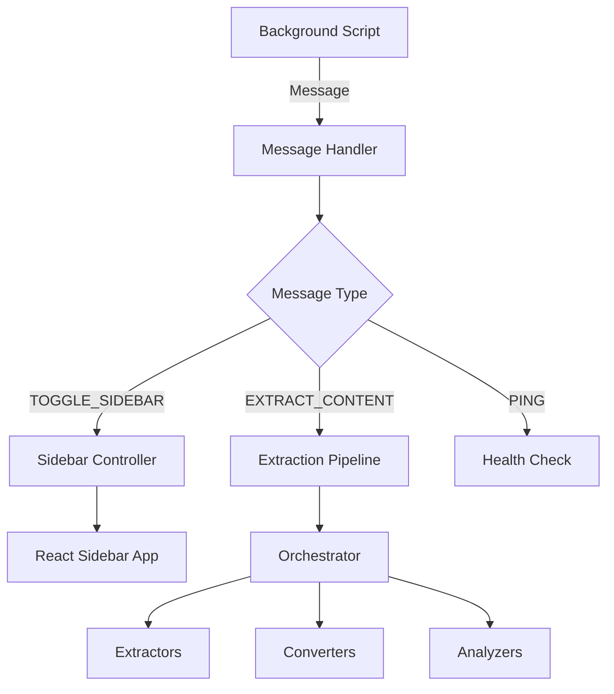

# Tab Extension Module (`tabext`)

## Overview

The `tabext` module is the content script portion of the browser extension that runs in the context of web pages. It handles sidebar injection, content extraction, and serves as the communication bridge between web pages and the extension's background service worker.

## Architecture

```
src/tabext/
├── index.ts                    # Entry point & initialization
├── core/                       # Core functionality
│   ├── documentPatcher.ts     # Document API patches
│   ├── messageHandler.ts      # Message routing & handling
│   └── sidebarController.ts   # Sidebar lifecycle management
├── extraction/                 # Content extraction pipeline
│   ├── index.ts               # Public extraction API
│   ├── orchestrator.ts        # Main extraction coordinator
│   ├── extractors/            # Extraction strategies
│   │   └── defuddle.ts       # Defuddle-based extraction
│   ├── converters/            # Format converters
│   │   └── markdownConverter.ts # HTML to Markdown
│   └── analyzers/             # Content analysis tools
│       ├── contentAnalyzer.ts   # Text analysis (word count, etc.)
│       └── metadataExtractor.ts # Page metadata extraction
└── utils/                      # Utility functions
    ├── domUtils.ts            # DOM manipulation utilities
    ├── textUtils.ts           # Text processing utilities
    └── tabUtils.ts            # Tab-related utilities
```

## Core Components

### 1. Entry Point (`index.ts`)

The main entry point that initializes all core modules:

```typescript
// Initialization sequence
1. Apply document patches (for asset URL resolution)
2. Initialize sidebar controller
3. Set up message handler
4. Notify background script that content is ready
```

### 2. Core Modules

#### Document Patcher (`core/documentPatcher.ts`)

Patches browser DOM APIs to ensure dynamic content uses proper extension URLs:

- Intercepts `document.querySelector` for link elements
- Patches `document.createElement` for dynamic script/link creation
- Converts relative asset paths to extension URLs

#### Message Handler (`core/messageHandler.ts`)

Manages all incoming messages from the background script:

- `TOGGLE_SIDEBAR`: Shows/hides the sidebar
- `CLOSE_SIDEBAR`: Explicitly closes the sidebar
- `EXTRACT_CONTENT`: Extracts page content
- `PING`: Health check

#### Sidebar Controller (`core/sidebarController.ts`)

Manages the sidebar lifecycle:

- Lazy loads the sidebar React app
- Tracks sidebar open/closed state
- Handles mount/unmount operations

### 3. Content Extraction

#### Orchestrator (`extraction/orchestrator.ts`)

Coordinates the entire extraction pipeline:

```typescript
// Extraction flow
1. Validate extraction options
2. Try Defuddle extraction (primary)
3. Clean and normalize HTML
4. Convert to Markdown
5. Analyze content features
6. Apply size limits
7. Return structured content
```

#### Extractors

- **Defuddle** (`extractors/defuddle.ts`): Uses the Defuddle library for intelligent content extraction

#### Converters

- **Markdown** (`converters/markdownConverter.ts`): Converts HTML to clean Markdown using Turndown

#### Analyzers

- **Content Analyzer** (`analyzers/contentAnalyzer.ts`):
  - Detects code blocks and tables
  - Counts words
  - Generates excerpts
- **Metadata Extractor** (`analyzers/metadataExtractor.ts`):
  - Extracts title, author, date
  - Parses Open Graph and Twitter meta tags
  - Handles various metadata formats

### 4. Utilities

#### DOM Utilities (`utils/domUtils.ts`)

- `isVisible()`: Checks element visibility
- `normalizeUrls()`: Converts relative to absolute URLs
- `cleanHtml()`: Removes scripts, styles, and noise

#### Text Utilities (`utils/textUtils.ts`)

- `clampText()`: Safely truncates text with boundaries

#### Tab Utilities (`utils/tabUtils.ts`)

- `getCurrentTabId()`: Gets the current tab ID
- `getCurrentTabIdSafe()`: Safe version that returns null on error

## Message Flow



## Content Extraction Pipeline

The extraction pipeline follows a robust, multi-step approach:

1. **Extraction Options Validation**
   - Timeout (default: 2000ms)
   - Include links (default: true)
   - Max length (default: 200,000 chars)

2. **Primary Extraction (Defuddle)**
   - Intelligent content detection
   - Removes ads, navigation, footers
   - Preserves main article content

3. **HTML Processing**
   - Cleans malicious/unnecessary elements
   - Normalizes URLs for offline viewing
   - Preserves semantic structure

4. **Markdown Conversion**
   - GitHub Flavored Markdown support
   - Preserves code blocks with language hints
   - Handles tables, lists, and formatting
   - Optional link preservation

5. **Content Analysis**
   - Word count calculation
   - Code block detection
   - Table detection
   - Excerpt generation

6. **Size Management**
   - Applies character limits
   - Tracks truncation status
   - Preserves content integrity

## API Usage

### Extracting Content

```typescript
import { extractContent } from '@tabext/extraction';

// Basic extraction
const content = await extractContent();

// With options
const content = await extractContent({
  timeout: 5000, // 5 second timeout
  includeLinks: false, // Strip links
  maxLength: 100000, // Limit to 100k chars
});
```

### Converting HTML to Markdown

```typescript
import { htmlToMarkdown } from '@tabext/extraction';

const markdown = await htmlToMarkdown(htmlString, {
  includeLinks: true, // Preserve links in output
});
```

### Analyzing Content

```typescript
import { detectCodeBlocks, countWords, generateExcerpt } from '@tabext/extraction';

const hasCode = detectCodeBlocks(markdown);
const wordCount = countWords(text);
const excerpt = generateExcerpt(content);
```

## Error Handling

The module implements comprehensive error handling:

- **Timeout Protection**: All operations have configurable timeouts
- **Graceful Degradation**: Falls back to basic text extraction if advanced methods fail
- **Error Classification**: Specific error codes for different failure types
- **Safe DOM Access**: All DOM operations handle edge cases

Error codes:

- `EXTRACTION_TIMEOUT`: Operation exceeded time limit
- `EXTRACTION_NETWORK_ERROR`: Network-related failure
- `EXTRACTION_DOM_ERROR`: DOM access issues
- `EXTRACTION_MEMORY_ERROR`: Memory constraints
- `EXTRACTION_PARSING_ERROR`: Content parsing failed

## Security Considerations

1. **Content Sanitization**: All extracted HTML is sanitized using DOMPurify
2. **Script Removal**: Scripts and potentially dangerous elements are stripped
3. **URL Validation**: URLs are validated before normalization
4. **Isolated Execution**: Runs in content script sandbox

## Performance Optimizations

- **Lazy Loading**: Sidebar and extraction modules load on-demand
- **Module Caching**: Dynamic imports are cached after first load
- **Timeout Enforcement**: Prevents hanging operations
- **Memory Management**: Large content is truncated appropriately

## Testing

The module includes comprehensive test coverage:

- Unit tests for individual utilities
- Integration tests for extraction pipeline
- E2E tests for sidebar interaction
- Performance benchmarks for extraction

Run tests:

```bash
npm test -- src/tabext
```

## Development Guidelines

1. **Module Independence**: Each module should be self-contained
2. **Error Handling**: Always handle edge cases gracefully
3. **Type Safety**: Use TypeScript types extensively
4. **Documentation**: Document complex logic inline
5. **Performance**: Consider memory and CPU impact

## Future Enhancements

- [ ] Add more extraction strategies (Readability, Mozilla's reader view)
- [ ] Implement content caching layer
- [ ] Add support for more output formats (PDF, DOCX)
- [ ] Enhance metadata extraction for academic papers
- [ ] Add content quality scoring
- [ ] Implement incremental extraction for large pages

## Debugging

Enable debug logging:

```typescript
// In contentExtractor.ts
const DEBUG = true; // Enable debug output
```

Chrome DevTools:

1. Open the page where content script runs
2. Open DevTools Console
3. Filter by "ContentExtractor" or "Defuddle"
4. Check for extraction timing and errors

## Dependencies

- **defuddle**: Intelligent content extraction
- **turndown**: HTML to Markdown conversion
- **turndown-plugin-gfm**: GitHub Flavored Markdown support
- **dompurify**: HTML sanitization
- **Chrome Extension APIs**: Message passing, runtime communication
